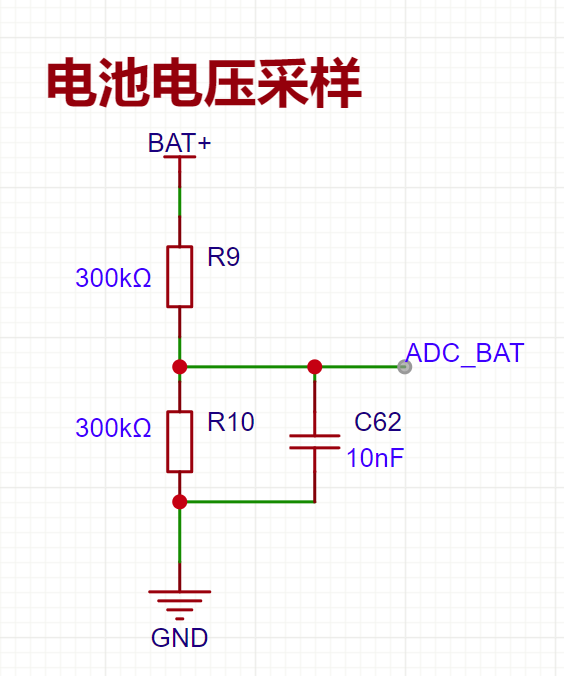

# battery_monitor 电池电量监测模块
## 概述
`battery_monitor` 是一个用于监测电池电量和电压的模块，基于 ESP-IDF 的 ADC（模数转换器）功能。该模块通过测量电池电压，计算出电池的剩余电量百分比，并提供了相应的 API 接口。

**支持功能:**
- **电压测量：** 通过 ADC 测量电池电压。
- **电量计算：** 根据电压值计算电池的剩余电量百分比。
- **校准功能：** 提供校准功能，用于补偿 ADC 和电池电压的测量误差。

## 硬件要求
- 电池电压分压电路，将电池电压分压到 ADC 输入引脚。

**参考电路如下**


## 校准

修改[battery_monitor.h](include\battery_monitor.h)中的 **`ADC_OFFSET` 和 `VOL_OFFSET`** 参数，以补偿 ADC 和电池电压的测量误差。

具体计算步骤如下：

---

### 1. **`ADC_OFFSET` (ADC 偏移电压校正)**
`ADC_OFFSET` 用于补偿 ADC 原始值的偏差。

#### 计算步骤：
1. **测量实际输入电压：**
   使用精确的万用表测量分压电路输出到 ADC 输入引脚的实际电压，记为 `V_actual`。

2. **读取 ADC 输出电压：**
   运行`git_adc_voltage()`代码读取 ADC 转换的电压值，记为 `V_adc_raw`。

3. **计算偏移：**
   \[
   \text{ADC\_OFFSET} = V_{\text{actual}} - V_{\text{adc\_raw}}
   \]


采样多组数据，取平均值，以降低噪声影响。

---

### 2. **`VOL_OFFSET` (电池电压校正)**
`VOL_OFFSET` 用于校正计算出的电池电压偏差。

#### 计算步骤:
1. **测量电池电压：**
   使用万用表直接测量电池端子的实际电压，记为 \( V_{\text{battery\_actual}} \)。

2. **计算推导电压：**
   使用`battery_monitor_get_voltage()`测量电池电压，记为 \( V_{\text{battery\_calculated}} \)。

3. **计算校正偏移：**
   \[
   \text{VOL\_OFFSET} = V_{\text{battery\_actual}} - V_{\text{battery\_calculated}}
   \]

在多个不同电压水平（例如电池电量高、中、低）下测量并校正，以确保偏移在整个范围内有效。

## 使用方法
``` c
#include "battery_monitor.h"
#include "freertos/FreeRTOS.h"
#include "freertos/task.h"
#include "esp_log.h"

#define TAG "Main"

void app_main()
{
    // 初始化电池监测模块
    battery_monitor_init();

    while (1) {
        float voltage = battery_monitor_get_voltage();
        float percentage = battery_monitor_get_percentage();

        ESP_LOGI(TAG, "Battery Voltage: %.2f V", voltage);
        ESP_LOGI(TAG, "Battery Percentage: %.2f%%", percentage);

        vTaskDelay(pdMS_TO_TICKS(1000)); // 每秒打印一次
    }
}

```

## 依赖项

- ESP-IDF >= 5.3.1
- led_strip 灯条驱动库

## 许可证

本项目采用 MIT 许可证。更多信息请参阅 [LICENSE](LICENSE) 文件。

## 贡献

欢迎任何形式的贡献，包括但不限于代码改进、文档更新、问题反馈等。请通过 GitHub 提交 Pull Request 或 Issue。

## 作者

- 宁子希 (1589326497@qq.com)


## 历史版本
- 1.0.0 初始版本


